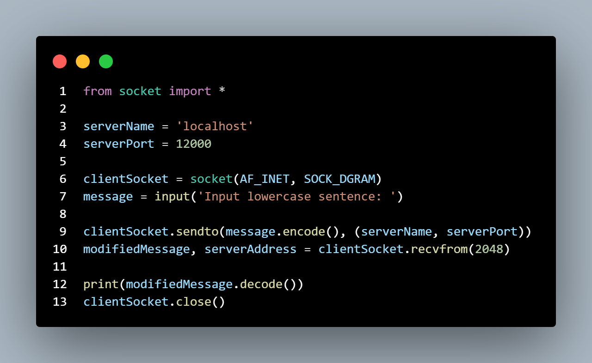
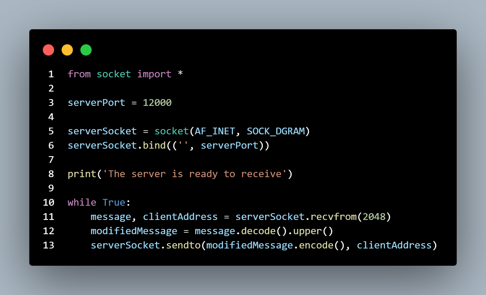
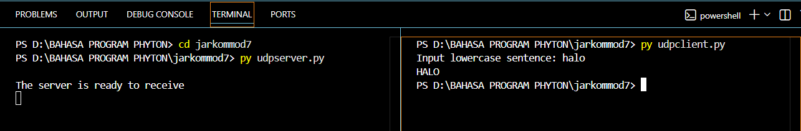
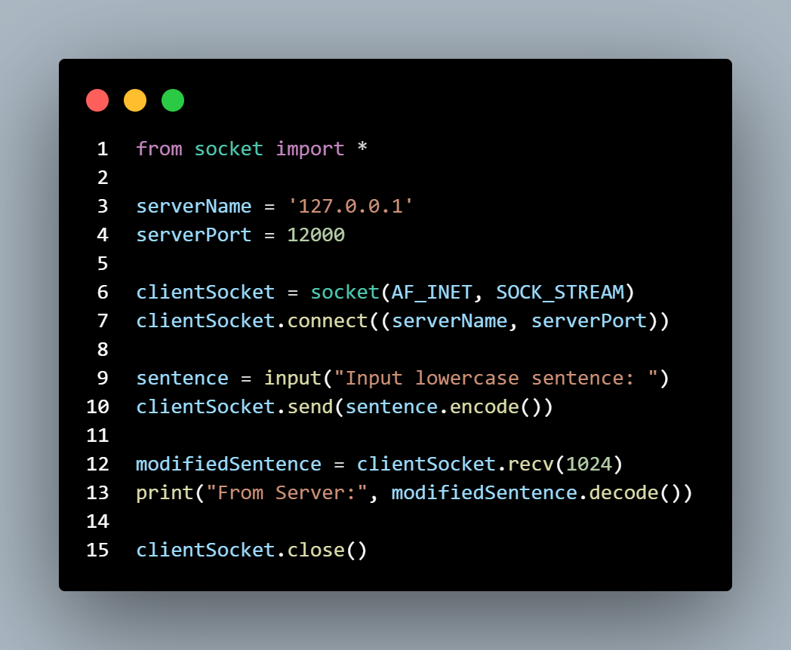
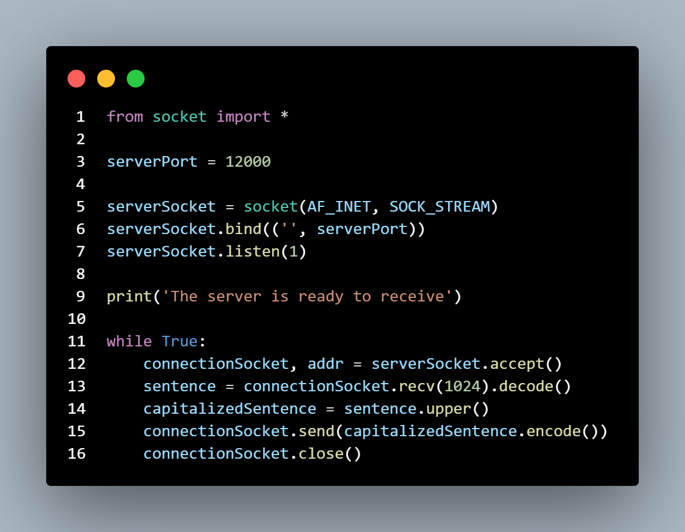
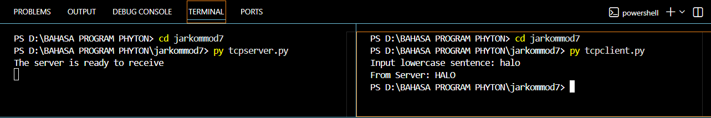

## Laporan Praktikum Jarkom

# Langkah Percobaan
1. 7.2.1
2. 7.2.2
3. 7.3.1
4. 7.3.2

# Lampiran
1. UDPClient

2. UDPServer

Output UDPClient Dan UDPServer :

3. TCPClient

4. TCPServer

Output TCPClient Dan TCPServer :

